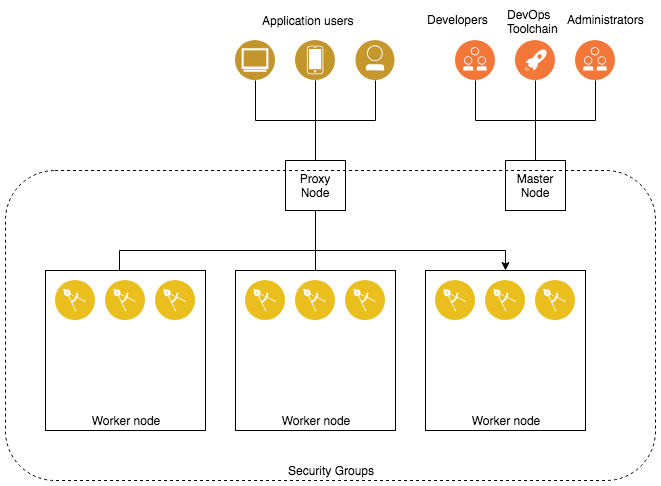

# ICP minimal installation on Google Cloud - Terraform Template

This Terraform template deploys on Google Cloud the [IBM Cloud Private](https://www.ibm.com/cloud-computing/products/ibm-cloud-private/) version 3.1.1 in a minimal configuration, using the ICP 3.1.1 CE binaries from Docker Hub. 

## Deployment overview
This template creates an environment where
 - The ICP cluster is deployed on a private network and VMs are accessed on public IP using a [NAT Gateway](https://cloud.google.com/nat/docs/overview)
 - There are no load balancers, but applications can be accessed via the public IP of master node
 - Most ICP services are disabled (they can be activated using the `List of disabled management services` property list available on deploy)
 - Minimal VM sizes ( the size can be changes at deployment time )
 - No separate boot node
 - One Master node only. The Master node has also the role of the Boot node so only one Master vm can be deployed in this configuration.
 - No Vulnerability Advisor node and vulnerability advisor service disabled by default
 - The number of the Management and Worker nodes can be specified at deployment time.
 Note : If the number of Management, Worker and Proxy are set to zero, the Master vm will take the role of the Worker, Management and Proxy node respectively.
 - You cannot deploy more than one Proxy node since there is no load balancer defined. 

## Architecture Diagram

For more infomation on IBM Cloud Private Nodes, please reference the Knowledge Center: <https://www.ibm.com/support/knowledgecenter/en/SSBS6K_3.1.1/getting_started/architecture.html>

## Pre-requisites

* The template has been tested on Ubuntu 16.04.  RHEL is not supported in this version.

#### Security Groups

The automation leverages Security Groups to lock down public and private access to the cluster.

- SSH is allowed to all cluster nodes to ease exploration and investigation
- UDP and TCP port 30000 - 32767 are allowed on proxy node to enable use of [NodePort](https://www.ibm.com/support/knowledgecenter/en/SSBS6K_3.1.0/manage_applications/expose_app.html)
- Inbound communication to the master node is permitted on [ports relevant to the ICP service](https://www.ibm.com/support/knowledgecenter/en/SSBS6K_3.1.0/supported_system_config/required_ports.html)
- All outbound communication is allowed.
- All other communication is only permitted between cluster nodes.

## Template Variables

The following tables list the template variables.

| Name | Required | Description | Default |
|------|-------------|:----:|:-----:|
| `ssh_user`   | yes          | Username for IBM Cloud infrastructure account | icpdeploy |
| `region`   | yes           | The region the resource should be created in. | |
| `zone`   | yes           | The region zone the resource should be created in. | |
| `image_type`   | yes           | The OS project and family to install on the VSIs. Only Ubuntu 16.04 has been validated. | ubuntu |
| `icp_inception_image` | yes | ICP image to use for installation  | ibmcom/icp-inception:3.1.1 |
| `icppassword` | no | ICP administrator password.  One will be generated if not set. | |
| `deployment` | yes | Identifier prefix added to the host names of all your infrastructure resources for organising/naming ease | icp |
| `network_interface` | yes | Network interface for the VMs | ens4 |

### Master Node Input Settings

| Name | Description | Type | Default |
|------|-------------|:----:|:-----:|
| nodes | Master number of nodes | int | `1` |
| memory | Master Node Memory Allocation (mb) | string | `32768` |
| cpu | Master Node vCPU Allocation | string | `12` |
| disk_size | Master Node Boot Disk Size (GB)  | int | `300` |
| docker_vol_size | Master Nodes Docker Disk size (GB) | int | `100` |

### Proxy Node Input Settings

| Name | Description | Type | Default |
|------|-------------|:----:|:-----:|
| nodes | Proxy number of nodes. If set to 0, the Master Node becomes Proxy node too. | int | `0` | 
| memory | Proxy Node Memory Allocation (mb) | string | `4096` |
| cpu | Proxy Node vCPU Allocation | string | `4` |
| disk_size | Proxy Node Boot Disk Size (GB)  | int | `100` |
| docker_vol_size | Proxy Nodes Docker Disk size (GB) | int | `100` |

### Management Nodes Input Settings

| Name | Description | Type | Default |
|------|-------------|:----:|:-----:|
| nodes | Management number of nodes. If set to 0, the Master Node becomes Management node too. | int | `0` | 
| memory | Management Node Memory Allocation (mb) | string | `16384` |
| cpu | Management Node vCPU Allocation | string | `4` |
| disk_size | Management Node Boot Disk Size (GB)  | int | `100` |
| docker_vol_size | Management Nodes Docker Disk size (GB) | int | `100` |

### Worker Nodes Input Settings

| Name | Description | Type | Default |
|------|-------------|:----:|:-----:|
| nodes | Worker number of nodes. If set to 0, the Master Node becomes Worker node too. | int | `0` | 
| memory | Worker Node Memory Allocation (mb) | string | `16384` |
| cpu | Worker Node vCPU Allocation | string | `4` |
| disk_size | Worker Node Boot Disk Size (GB)  | int | `100` |
| docker_vol_size | Worker Nodes Docker Disk size (GB) | int | `100` |

## Template Output Variables

| Name | Description |
|------|-------------|
| ibm_cloud_private_admin_url | IBM Cloud Private Cluster URL |
| ibm_cloud_private_admin_user | IBM Cloud Private Admin Username |
| ibm_cloud_private_admin_password | IBM Cloud Private Admin Password |
| ibm_cloud_private_cluster_name | IBM Cloud Private Cluster name |
| ibm_cloud_private_cluster_CA_domain_name | IBM Cloud Private CA domain name |
| ibm_cloud_private_boot_ip | IP of the IBM Cloud Private Boot node |
| ibm_cloud_private_master_ip | IP of the IBM Cloud Private Master Load Balancer |
| ibm_cloud_private_ssh_user | SSH user used to access the vms |
| ibm_cloud_private_ssh_key | SSH key, base64 encoded, used to access the vm using the above ibm_cloud_private_ssh_user |
| connection_name | Name of the Connection Data Object created after the instance deployment. Used to access the IBM Cloud Private instance from other deployments |
